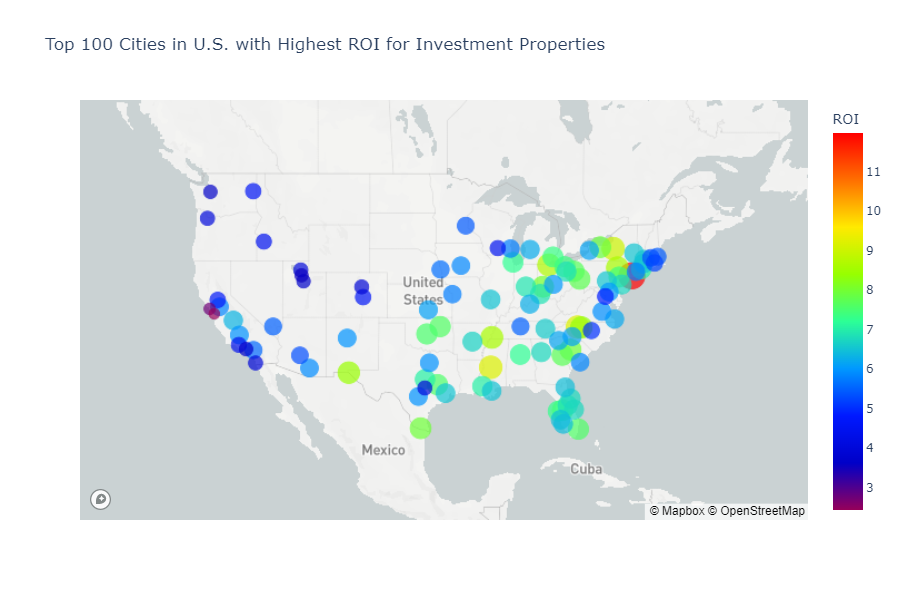
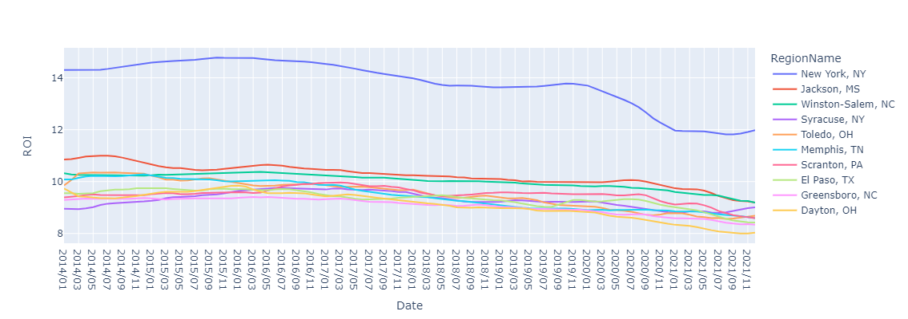
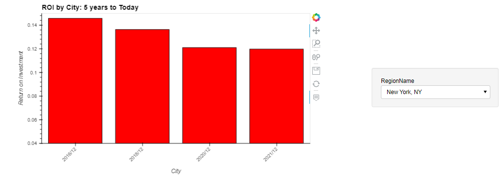
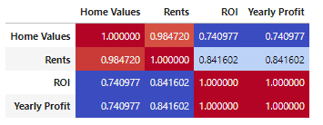

# Title : Real Estate Returns
## Background

Real estate is generally a great investment option. It can generate ongoing passive income and can be a good long-term investment if the value increases over time. You may even use it as a part of your overall strategy to begin building wealth.
## Research Questions:
**Which cities in the United States offer best ROI for purchasing rental properties considering home purchase value and rental value?** 

**List top 10 markets.**
New York, NY (Inclusive of all Five Boroughs); Jackson, MS; Winston-Salem, NC; Syracuse, NY; Toledo, OH; Memphis, TN; Scranton, PA; El Paso, TX; Greensboro, NC and Dayton, OH.
# Top 10 Cities - ROI

**Historically, how have these cities performed. How have they faired in the last 1, 3 and 5 years in terms of ROI.**

New York City, despite being an expensive real estate market has had consistently high ROI . New York City has been ranked first among cities across the globe in attracting capital, business, and tourists. On the other hand, many of the other cities on our list ,like Jackson, Mississipi have lower home values but rents are relatively higher. This is also seen in Scranton, PA, where homevalues are well below the national median. This makes it a healthy place to invest. 
# ROI by City:5 years to Today - ROI

**Which cities would give the best ROI projecting one year out**
Projecting a year out our cities have a slight drop in ROI. This may be due to the growth in rent payments , with more people seeing the value in purchasing vs.renting. As seen below , there is a positive correlation between rents and home values. 
# Correlation between home values and rents

